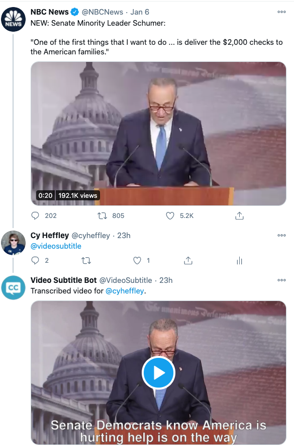

# Twitter Subtitle Bot

## NOTE
As of December 2021, this account is no longer active or responsive. The problem solved by this bot is a duplicate of that solved by the [HeadlinerClip Caption service](https://twitter.com/headlinerclip).

All documentation below is outdated as of December 2021.

## About
Account URL: https://twitter.com/videosubtitle

This bot, when mentioned in reply to a video on Twitter, replies with a captioned version of the video if the video is less than 140 seconds. Captioning is done with Google Cloud Speech-to-Text, but we're currently exploring open-source alternatives to minimize expenses.

An example of the interaction can be seen below.

## Data Retention
`delete_tweets_job.py` runs on our server every ten minutes. This script checks if original tweets can no longer be publicly accessed and, if so, deletes tweet(s) from the bot of the subtitled video (or the bot's "We couldn't find a video" message, etc). This ensures that no copies of a video are retained in the case that a user changes their account to private or their original tweet is deleted.
